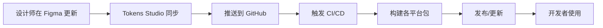

# Design Tokens System

> 统一的设计令牌系统，支持 Figma + Tokens Studio 到多平台（Flutter、React、Tailwind）的自动化同步

## 🎯 项目概述

本项目通过 Figma 和 Tokens Studio 插件管理设计令牌（Design Tokens），实现设计到代码的自动化同步。支持 Flutter、React/Next.js、Nuxt 等多个前端平台，并保持各平台的原生使用习惯。

### 核心特性

- 🎨 **三层 Token 架构**：Primitive → Semantic → Component
- 🔄 **自动化同步**：Figma 更新自动触发 CI/CD 构建
- 📦 **多平台支持**：Flutter、Tailwind CSS、CSS 变量
- 🌓 **暗黑模式**：内置明暗主题支持
- 🔧 **零破坏性**：完全兼容现有代码
- 📝 **类型安全**：TypeScript 和 Dart 强类型支持

## 📚 Token 架构

### 三层结构

```
├── Primitive Tokens (原始层)
│   ├── colors      # 基础色板：blue-500, gray-100
│   ├── spacing     # 基础间距：4px, 8px, 16px
│   ├── typography  # 基础字体：14px, 16px, 20px
│   └── radius      # 基础圆角：4px, 8px, 12px
│
├── Semantic Tokens (语义层)
│   ├── colors
│   │   ├── background    # 背景色：base, elevated
│   │   ├── text         # 文本色：primary, secondary
│   │   ├── border       # 边框色：default, focus
│   │   └── interactive  # 交互色：hover, pressed
│   └── spacing
│       ├── padding      # 内边距：small, medium, large
│       └── gap          # 间距：tight, normal, loose
│
└── Component Tokens (组件层)
    ├── button
    ├── card
    ├── input
    └── navigation
```

### 命名规范

```javascript
// 基础格式
{category}.{property}.{variant}.{state}

// 示例
color.primary              // 默认主色
color.primary.hover        // 悬停状态
color.background.base      // 基础背景
color.text.secondary       // 次要文本
spacing.padding.medium     // 中等内边距
component.button.padding.x // 按钮水平内边距
```

## 🚀 快速开始

### 1. 安装依赖

```bash
ppnpm add
```

### 2. 配置 Tokens Studio

在 Figma 中安装 Tokens Studio 插件，配置同步到本仓库的 `tokens/figma` 目录。

### 3. 构建 Tokens

```bash
# 构建所有平台
pnpm run build

# 构建特定平台
pnpm run build:flutter
pnpm run build:tailwind
pnpm run build:css
```

## 📦 平台集成

### Flutter 集成

```yaml
# pubspec.yaml
dependencies:
  wisburg_design_tokens: ^1.0.0
```

```dart
// 使用方式
import 'package:wisburg_design_tokens/design_tokens.dart';

// 1. 应用主题
MaterialApp(
  theme: DesignTokens.lightTheme,
  darkTheme: DesignTokens.darkTheme,
);

// 2. 直接使用颜色
Container(
  color: DesignTokens.colors.primary,
  padding: EdgeInsets.all(DesignTokens.spacing.md),
);

// 3. 使用 ColorScheme（保持原有方式）
final colorScheme = Theme.of(context).colorScheme;
```

### Tailwind CSS 集成

```bash
pnpm add @wisburg/design-tokens-tailwind
```

```javascript
// tailwind.config.js
const designTokens = require('@wisburg/design-tokens-tailwind')

module.exports = {
  theme: {
    // 直接替换，保持向后兼容
    colors: designTokens.colors,
    spacing: designTokens.spacing,
    borderRadius: designTokens.radius,
  }
}
```

```html
<!-- 原有类名继续工作 -->
<div class="text-primary-500 bg-neutral-100 p-4 rounded-lg">
  内容
</div>

<!-- 新增语义化类名 -->
<div class="text-primary bg-surface p-md rounded-md">
  内容
</div>
```

### CSS 变量集成（React/Vue/原生 JS）

```bash
pnpm add @wisburg/design-tokens-css
```

```javascript
// 在你的主入口文件引入 CSS 变量
import '@wisburg/design-tokens-css/css/variables.css'

// 可选：使用 JavaScript 对象
import { tokens } from '@wisburg/design-tokens-css'

// 可选：TypeScript 类型
import type { DesignTokens } from '@wisburg/design-tokens-css'
```

```css
/* 使用 CSS 变量 */
.button {
  background: var(--color-primary-500);
  padding: var(--spacing-4);
  border-radius: var(--radius-md);
}

/* 响应暗色模式 */
@media (prefers-color-scheme: dark) {
  .button {
    background: var(--color-primary-400);
  }
}
```

```javascript
// 或在 JS 中使用
const styles = {
  color: tokens.colors.text.primary,
  padding: tokens.spacing.md
}

## 🔄 工作流程



### CI/CD 配置

当 `tokens/` 目录有更新时，自动触发构建：

1. 验证 Token 格式
2. 生成各平台文件
3. 运行测试
4. 发布新版本（如有必要）

## 📁 项目结构

```
design-tokens/
├── tokens/
│   ├── figma/           # Tokens Studio 导出的原始文件
│   ├── transformed/     # 转换后的标准格式
│   └── platforms/       # 各平台的最终输出
├── scripts/
│   ├── transform.js     # Token 转换主逻辑
│   ├── build-flutter.js # Flutter 构建脚本
│   ├── build-tailwind.js # Tailwind 构建脚本
│   └── build-css.js     # CSS/Web 构建脚本
├── packages/
│   ├── flutter/         # Flutter 包
│   ├── tailwind/        # Tailwind 配置包
│   └── css/             # CSS 变量包
├── examples/            # 各平台使用示例
├── docs/                # 详细文档
└── .github/
    └── workflows/       # GitHub Actions 配置
```

## 🛠️ 开发指南

### 添加新的 Token

1. 在 Figma 中通过 Tokens Studio 添加
2. 同步到代码仓库
3. 运行 `pnpm run build` 验证
4. 提交 PR

### 自定义转换规则

编辑 `scripts/transform.js` 中的映射规则：

```javascript
// 自定义颜色映射
const colorMapping = {
  'surface.elevated': {
    light: '{color.neutral.50}',
    dark: '{color.neutral.900}'
  }
}
```

### 测试

```bash
# 运行所有测试
npm test

# 测试特定平台
pnpm run test:flutter
pnpm run test:tailwind
```

## 🤝 贡献指南

1. Fork 本仓库
2. 创建特性分支：`git checkout -b feature/amazing-feature`
3. 提交更改：`git commit -m 'Add amazing feature'`
4. 推送分支：`git push origin feature/amazing-feature`
5. 提交 Pull Request

## 📄 License

MIT License

## 🔗 相关链接

- [Tokens Studio 文档](https://docs.tokens.studio/)
- [Style Dictionary](https://amzn.github.io/style-dictionary/)
- [设计系统最佳实践](https://www.designsystems.com/)